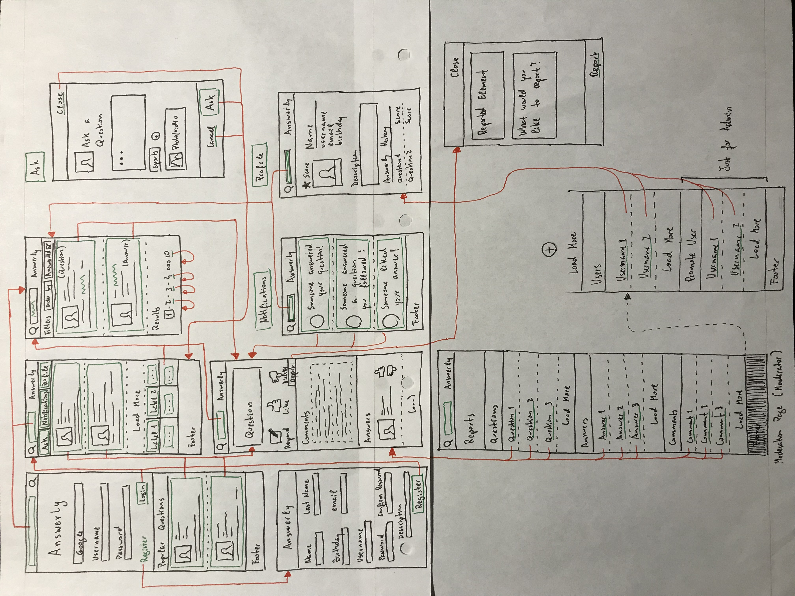

# A3: User Interface Prototype

Our project, Answerly, is a web application for collaborative Questions and Answers.

This artifact specifies the project's interface elements and features, the websites sitemap and a brief description of the main interactions with the systems (storyboards)

## 1. Interface and common features

*Answerly* is a web application consisting in a set of web pages made with: HTML5, Javascript and CSS3. The user interface was implemented using the Bootstrap framework.  
The platform was developed with both desktop and mobile users in mind, so that it adapts to screens of different sizes and resolution while keeping its functionality.

We aim for the users to quickly find the questions and answers they are looking for. Thus, our homepage will contain several answers that you can scroll around sorted by points or, if the user is logged in, by questions of topics he previously chose to follow.

Figure 1.a: Home Page.

1. Preencher com numeros da foto
2. 

We also developed a individual page for each question so that the user has an easier time looking through more details about the questions.

In each question we can see the full description of the question and additional information about the author and the question's points.

Following the description we will be able to find answers for the questions which can receiver votes from other useres wheter it is helpful or not.

There will also a section with users to post comments if they want to give a insight about something in particular. 

Figure 1.b: Question Interface.

1. 

## 2. Sitemap

Here below we can find a sitemap representing the overall structure of the project.

## 3. Storyboards

## 4. Interfaces

### Homepage

#### UI01: Homepage
Main website page where you scroll through the hottest questions

Desktop           |  Mobile
:-------------------------:|:-------------------------:
  |  

**Figure X**: [Homepage](link)

###A1. Annexes
Hand-made wireflows of the desktop version of the website

Hand-made wireflows of the mobile version of the website

## Revision history
1. First submission (24/02/2020).

------

GROUP2064, 24/02/2020

- Antonio Pedro Reis Ribeiro Sousa Dantas, up201703878@fe.up.pt
- [Editor] Eduardo João Santana Macedo, up201703658@fe.up.pt
- Nuno Miguel Teixeira Cardoso, up201706162@fe.up.pt
- Paulo Roberto Dias Mourato, up201705616@fe.up.pt
