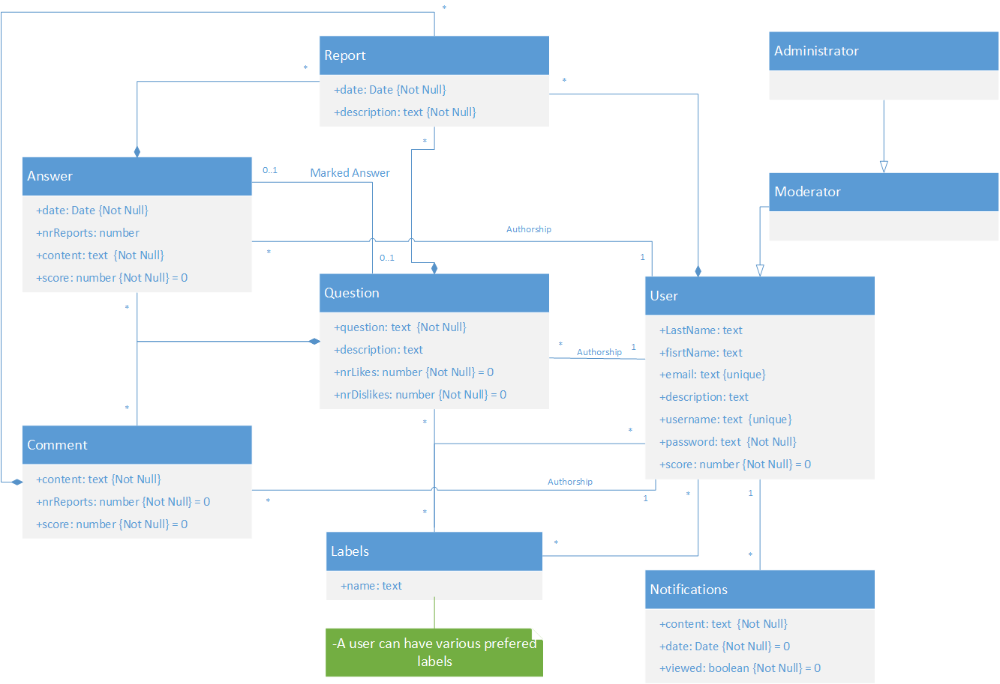

# A4: Conceptual Data Model

Our project, Answerly, is a web application for collaborative Questions and Answers.
This artifact consists in the Conceptual Domain Model, containing the UML class diagram showing the identification, description and relation between the many identities of the project.

**Figure 1:** Class diagram
## 2. Additional Business Rules

* Users can't vote on their own answers or questions.
* A question can only have one answer marked as correct at most.

***

## Revision history
1. First submission (16/03/2020).
------

GROUP2064, 16/03/2020
- Antonio Pedro Reis Ribeiro Sousa Dantas, up201703878@fe.up.pt
- Eduardo João Santana Macedo, up201703658@fe.up.pt
- Nuno Miguel Teixeira Cardoso, up201706162@fe.up.pt
- [Editor] Paulo Roberto Dias Mourato, up201705616@fe.up.pt
