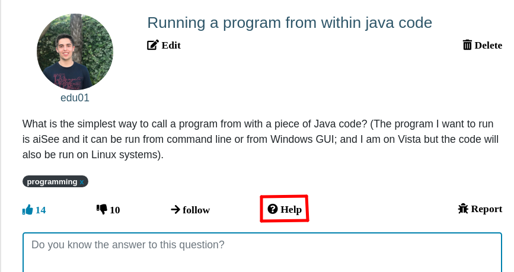
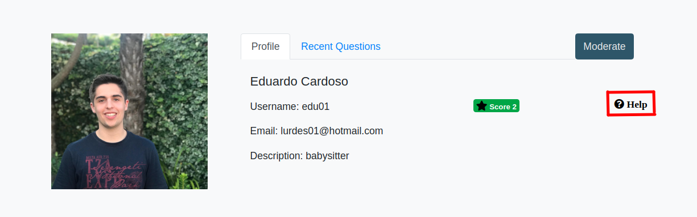

# A9: Product

Within the scope of the LBAW course, we were proposed to develop a web application for collaborative Questions and Answers, thus _Answerly_ was born. 
This artefact describes the final delivery of the project.

## 1. Installation

Link to the Github release: [Final Version](https://git.fe.up.pt/lbaw/lbaw1920/lbaw2064)


#### Docker Command
```
docker-compose up

docker run -it -p 8000:80 -e DB_DATABASE=lbaw2064 -e DB_USERNAME=lbaw2064 -e DB_PASSWORD=VP238750 lbaw2064/lbaw2064
```

## 2. Usage

URL to the product: http://lbaw2064.lbaw-prod.fe.up.pt  

### 2.1. Administration Credentials


| Username       | Password |
| --------       | -------- |
| pedrodantas    | 1234 |

### 2.2. User Credentials

| Type              | Username    | Password |
| -------------     | ----------- | -------- |
| moderator account | lurdes01    | 1234     |
| basic user account| vieira01    | 1234     |

## 3. Application Help

In order to improve the user experience, we added some help buttons to better inform the user the information thats is being presented to them in that page:

**Question:** Here it is explained to the user in what this page consists, what reports are and what the marked answers mean



**Profile:** In the profile we explain what information is presented, what you can edit and what a user's score means



## 4. Input Validation

For input validation on the client side, we used Javascript to validate the creation of a new question.

```Javascript
function sendCreateQuestionRequest(event) {

    let title = document.getElementById("formControlTextareaQuestion").value;
    let description = document.getElementById("formControlTextareaDescription").value;

    if (title != '' && description != '')
        sendAjaxRequest('put', '/api/question', { title: title, description: description }, questionAddedHandler);
    else {

        let older_alert = document.getElementById('alert_question');
        if (older_alert != null)
            return;

        let new_alert = createAlertQuestion();

        let section = document.getElementById("add_question_form");
        let list = document.getElementById("add_question_form");

        section.insertBefore(new_alert, list.childNodes[0]);

        return;

    }

    event.preventDefault();

}
function createAlertQuestion() {
    let new_alert = document.createElement('alert');
    new_alert.classList.add('alert');
    new_alert.innerHTML = ` <div id="alert_question" class="card text-white bg-danger">
                                <div class="card-body">
                                <p class="card-text">You must fill both title and description</p>
                                </div>
                            </div>`
    return new_alert;
}
```

We used server-side validators on the registration of the users.

```php 

protected function validator(array $data)
    {
        return Validator::make($data, [
            'first_name' => 'required|string|max:100',
            'last_name' => 'required|string|max:100',
            'email' => 'required|string|email|max:200|unique:user',
            'bio' => 'required|string|max:500',
            'username' => 'required|string|max:100|unique:user',
            'password' => 'required|string|min:6|confirmed',
        ]);
    }

    protected function create(array $data)
    {
        return User::create([
            'first_name' => $data['first_name'],
            'last_name' => $data['last_name'],
            'email' => $data['email'],
            'bio' => $data['bio'],
            'username' => $data['username'],
            'password' => bcrypt($data['password']),
        ]);
    }

```
## 5. Check Accessibility and Usability

Accessibility results: 14/18

Usability results: 24/28

The PDF files are included in the submitted ZIP file on Moodle.

## 6. HTML & CSS Validation

We had some errors on the pagination and we did not changed much regarding that since it was intrinsic to Laravel. Besides that we had no more errors.
We also had a few warnings that we did not find relevant. 
The PDF files are included in the submitted ZIP file on Moodle.


## 7. Revisions to the Project

The project had a good planning and the devolpment of the project went accordingly to plan. No major changes or restructures happened.

## 8. Implementation Details

### 8.1. Libraries Used

The following libraries and frameworks were used it his project:

- Bootstrap: open source toolkit for development with HTML, CSS, and JS.
- Font Awesome: an icon set and toolkit.
- Laravel: a PHP Framework For Web Artisans.


### 8.2 User Stories  

| US Identifier | Name                 | Priority  | Team members                                | State |
| ------------- | -------              | ----------| ------------------------------------------- | ------|
| US01 | Home Page            | Mandatory | All                                                  |  100% |
| US02 | Question's page      | Mandatory | Nuno Cardoso                                         |  100% |
| US09 | Sign Up              | Mandatory | All                                                  |  100% |
| US10 | Sign In              | Mandatory | All                                                  |  100% | 
| US13 | Create Question      | Mandatory | Nuno Cardoso, Pedro Dantas                           |  100% |
| US14 | Reply Question       | Mandatory | All                                                  |  100% |
| US15 | Logout               | Mandatory | All                                                  |  100% | 
| US26 | Edit my Content               | Important | Nuno Cardoso                                |  100% |
| US18 | Comment                       | Important | Nuno Cardoso, Pedro Dantas                  |  100% |
| US16 | Vote                          | Important | Eduardo Macedo                              |  100% |
| US03 | Search with Keywords          | Important | Nuno Cardoso, Roberto Mourato               |  100% |
| US17 | Set Labels on Question        | Important | Nuno Cardoso                                |  100% |
| US24 | Follow Questions              | Important | Nuno Cardoso, Pedro Dantas                  |  100% |
| US23 | Select best answer            | Important | Eduardo Macedo, Pedro Dantas                |  100% |
| US04 | Search with Labels            | Important | Eduardo Macedo, Roberto Mourato             |  100% |
| US05 | Search by Date                | Important | Nuno Cardoso                                |  100% |
| US37 | Remove Publications (Admin)   | Important | Nuno Cardoso                                |  100% |
| US30 | Edit Publications (Admin/Mod) | Important | Nuno Cardoso                                |  100% |
| US40 | Access Moderation Area        | Important | Nuno Cardoso, Pedro Dantas                  |  100% |
| US31 | View reported Users           | Important | Nuno Cardoso, Pedro Dantas                  |  100% |
| US29 | Add/Remove Labels (Admin/Mod) | Important | Eduardo Macedo, Nuno Cardoso, Pedro Dantas  |  100% |
| US41 | Access Profile Page | Medium Importance | Eduardo Macedo, Nuno Cardoso, Roberto Mourato |  100% |
| US27 | Visit a Profile     | Medium Importance | Nuno Cardoso                                  |  100% |
| US25 | Edit Profile Page   | Medium Importance | Eduardo Macedo, Roberto Mourato               |  100% |
| US20 | Report              | Medium Importance | Nuno Cardoso                                  |  100% |
| US34 | Manage Moderators   | Medium Importance | Nuno Cardoso                                  |  100% |
| US36 | Ban Users           | Medium Importance | Nuno Cardoso                                  |  100% |
| US28 | Delete Account      | Medium Importance | Nuno Cardoso                                  |  100% |
| US22 | Notifications       | Medium Importance | Eduardo Macedo, Pedro Dantas                  |  100% |
| US38 | Manage Administrator     | Low Importance | Nuno Cardoso                                |  100% |
| US42 | Recover Password         | Low Importance | ---                                         |    0% |
| US21 | Follow Labels            | Low Importance | ---                                         |    0% |
| US33 | View nr. of reports      | Low Importance | ---                                         |    0% |
| US35 | Filter Moderator Reports | Low Importance | ---                                         |    0% |
| US06 | Search with Users        | Low Importance | ---                                         |    0% |
| US07 | About us Page                           | Optional | Nuno Cardoso                       |  100% | 
| US39 | 404 page                                | Optional | Nuno Cardoso                       |  100% | 
| US11 | Sign Up w/ Google API                   | Optional | ---                                |    0% |
| US12 | Sign In w/ Google API                   | Optional | ---                                |    0% |
| US19 | History                                 | Optional | ---                                |    0% |
| US32 | Questions, Replies and Comments History | Optional | ---                                |    0% |
| US08 | View Statistics                         | Optional | ---                                |    0% |

#### New User Stories
| US Identifier | Name                 | Priority  | Description   |
| ------------- | -------              | ----------| ------------------------------------------- 
| US39 | 404 page | low | As a User, I want it is shown to me a 404 page, so that I know I am trying to access some inexistent page. | 
| US40 | Access Moderation Area | medium | As a Moderator, I want to be able to access a moderation area, so that I can check for user reports and events and better handle them. |
| US41 | Access Profile Page | medium | As an Authenticated user, I want to be able to access my profile page, so that I can see my account information. |
| US42 | Recover Password | low | As an Authenticated user, I want to be able to recover my password, so that I can login in the system once again. |

With our product, a user can ask questions, elaborate answers and comment. A user may also create an account and check its profile, or see other users public profile information.
Moderators and Administrators have access to a moderation area, where they can manage system's content.
Moderators can edit other users' content. Administrators can edit and delete other users' content. They are also abled to ban, demote and promote users.


## Revision history - a2

1. First submission (24/02/2020).
2. Minor changes in User Stories; added User Story to promote Admins; changed priorities in Moderator and Admin's User Stories; switched Ethics to Scalability as a crucial technical requirement (03/03/2020).
3. Specified the API as Google Sign In API in the actors' diagram and added user stories regarding search and select best answer features (10/03/2020).

## Revision history - a7

1. First submission (13/04/2020).
2. Changed some endpoints, fixed minor errors (03/05/2020).
3. Changes on requests' url for promote, demote and ban users (03/06/2020).

## Revision history
1. First submission (03/06/2020).

***
GROUP2064, 03/06/2020
 
- Antonio Pedro Reis Ribeiro Sousa Dantas, up201703878@fe.up.pt
- Eduardo João Santana Macedo, up201703658@fe.up.pt
- [Editor] Nuno Miguel Teixeira Cardoso, up201706162@fe.up.pt
- Paulo Roberto Dias Mourato, up201705616@fe.up.pt